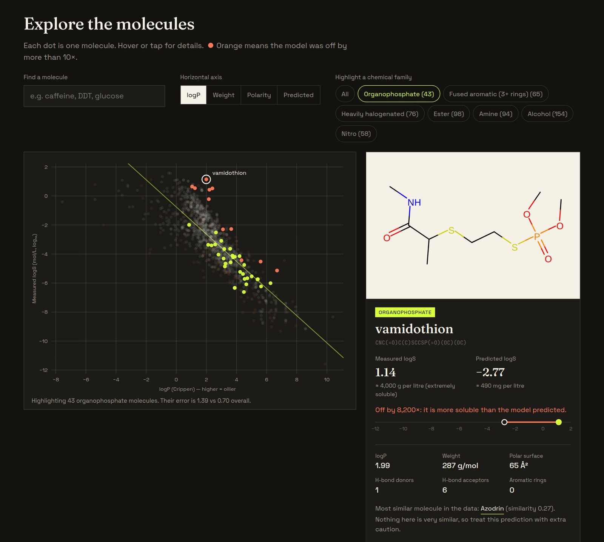
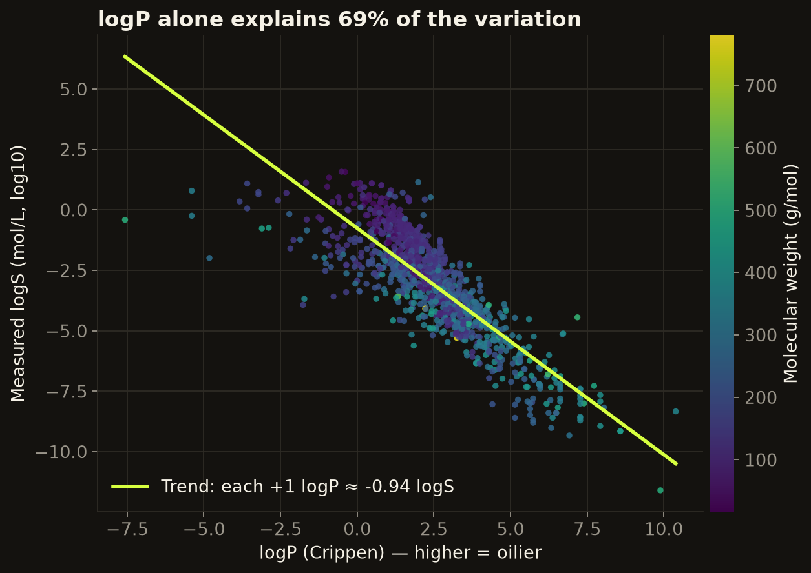
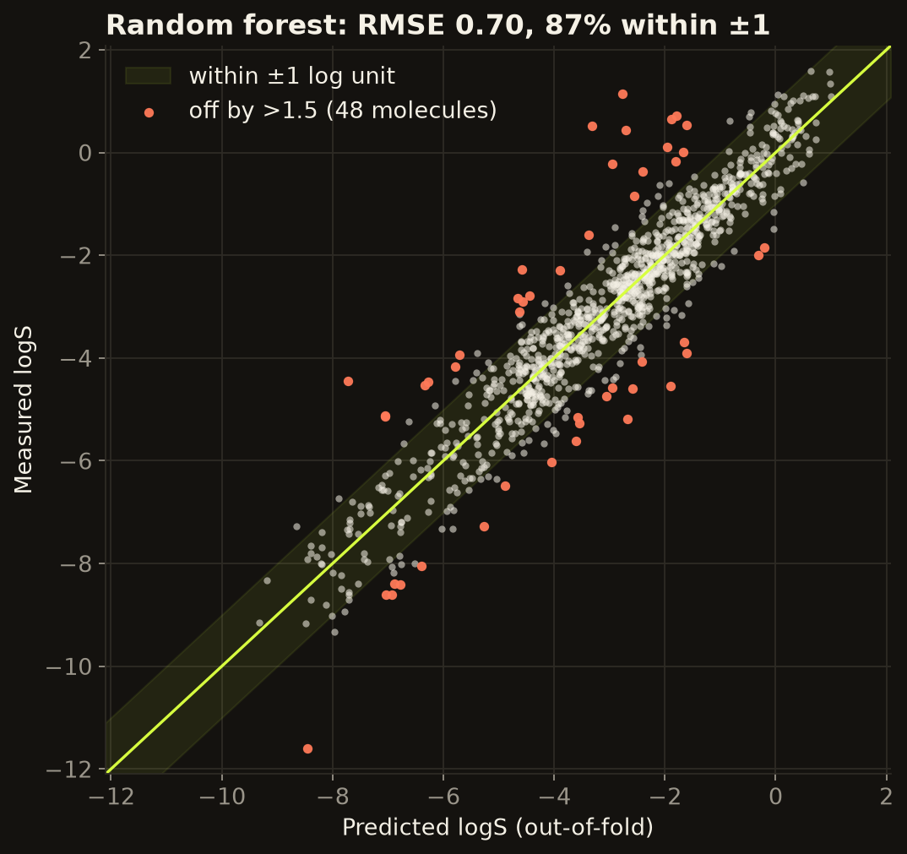
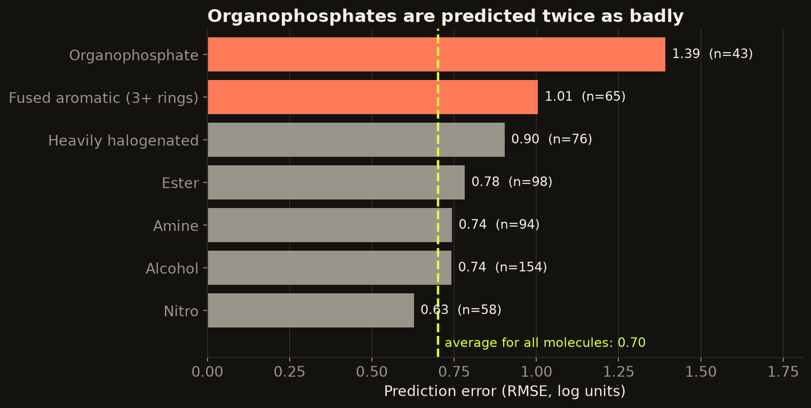
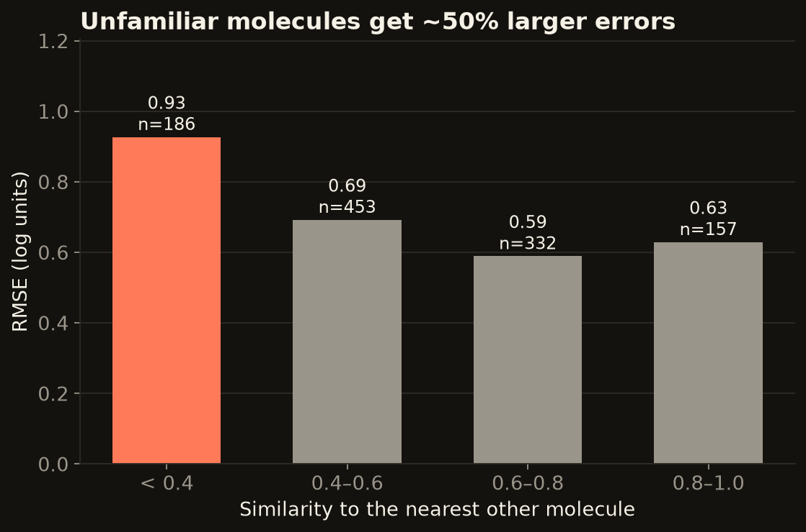

# What makes a molecule dissolve in water?

**A chemistry data analysis of 1,128 molecules: what drives water solubility, how well it can be predicted from structure alone, and where current models still fail.**

[**Live dashboard**](https://stevnatsan.github.io/molecule-solubility-analysis/) · [**Read the analysis**](notebooks/solubility_analysis.ipynb) · [**Run it yourself**](#run-it-on-your-computer)



Water solubility decides whether a drug can be absorbed, how far a pesticide travels in groundwater, and how a chemical behaves in a spill. It is slow and expensive to measure, so chemists rely on predictions. This project looks at how good those predictions are, and at the specific kinds of chemistry where they break down.

## Key findings

| | Finding | Evidence |
|---|---|---|
| 1 | **Oiliness (logP) is the main driver.** It alone explains 69% of the variation; each +1 in logP means roughly 9× lower solubility. | r = −0.83 |
| 2 | **A simple random forest beats the classic ESOL equation**, even though the equation was fitted on these same molecules. | RMSE 0.70 vs 0.91 log units |
| 3 | **Errors cluster by chemistry.** Organophosphates (common pesticides) are predicted twice as badly as average and are *always* more soluble than predicted. | RMSE 1.39, n = 43 |
| 4 | **Unfamiliar molecules are riskier.** Molecules unlike anything else in the data get ~50% larger errors. | RMSE 0.93 vs 0.59–0.69 |
| 5 | **The model is data-limited.** Error is still falling as training data grows. | 0.89 → 0.70 (90 → 902 molecules) |

<table>
  <tr>
    <td></td>
    <td></td>
  </tr>
  <tr>
    <td></td>
    <td></td>
  </tr>
</table>

## Open research questions

The errors aren't random noise. Each cluster points to something testable:

| # | Observation | Research question | How to test it |
|---|---|---|---|
| 1 | Organophosphates have ~2× the typical error and are always under-predicted. | Is the Crippen logP method mis-scoring phosphorus esters? | Compare with measured logP, or retrain with another logP method, and check whether the bias disappears. |
| 2 | Rigid, flat, high-melting solids (e.g. anthraquinone) are over-predicted. | How much of the remaining error comes from crystal packing rather than molecular structure? | Add melting point, the key term in Yalkowsky's General Solubility Equation, and measure the error drop for high-melting compounds. |
| 3 | Molecules with no close neighbour (similarity < 0.4) get ~50% larger errors. | Can the model reliably say "I don't know"? | Build an applicability-domain score and test whether it ranks the worst predictions first on held-out data. |
| 4 | The learning curve hasn't flattened. | How far can accuracy go with ~10× more data, and where is the measurement-noise floor? | Repeat on a larger curated set such as AqSolDB (~10k compounds) and estimate noise from duplicate measurements. |
| 5 | The dataset has **no carboxylic acids** and only 9 molecules above 500 g/mol. | How badly do ESOL-style models fail on ionisable, drug-sized compounds? | Evaluate on an external set of acids and larger molecules with pH-controlled solubility data. |

## How to access the project

### 1. Live dashboard (nothing to install)

Open **https://stevnatsan.github.io/molecule-solubility-analysis/** in any browser, on desktop or phone. You can:

- hover or tap any molecule to see its structure, measured vs predicted solubility (also in g per litre), and its closest neighbour in the data;
- highlight a chemical family (e.g. organophosphates) to see where the model struggles;
- switch the horizontal axis between oiliness, weight, polarity and the model's prediction;
- search by name (try *caffeine*, *DDT* or *glucose*). Every molecule has a shareable link like `#m=1038`.

### 2. Read the analysis on GitHub

Open [`notebooks/solubility_analysis.ipynb`](notebooks/solubility_analysis.ipynb). GitHub renders it with every chart and table, so you can follow the whole analysis without running anything.

### 3. Run it on your computer

You need Python 3.10 or newer.

```bash
git clone https://github.com/Stevnatsan/molecule-solubility-analysis.git
cd molecule-solubility-analysis

python -m venv .venv
source .venv/bin/activate            # Windows: .venv\Scripts\activate
pip install -r requirements.txt

jupyter notebook notebooks/solubility_analysis.ipynb   # re-run the analysis and charts
python scripts/build_dashboard.py                       # rebuild the dashboard data
python -m http.server 8000 --directory docs             # then open http://localhost:8000
pytest                                                  # run the tests
```

## Method

- **Data.** ESOL: measured aqueous solubility (logS, log₁₀ mol/L) for 1,128 molecules, spanning 13 orders of magnitude.
- **Features.** 11 descriptors computed with RDKit from each structure: logP, molecular weight, polar surface area, H-bond donors and acceptors, rotatable bonds, aromatic proportion, aromatic rings, fraction of sp³ carbon, halogen count, heavy-atom count.
- **Model.** Random forest (500 trees). Every reported prediction is **out-of-fold** from 5-fold cross-validation, so each molecule is predicted by a model that never saw it.
- **Error analysis.** Chemical families tagged with SMARTS patterns; similarity measured as Tanimoto similarity on Morgan fingerprints (radius 2, 2048 bits) to each molecule's closest neighbour.

## Project structure

```
├── data/delaney-processed.csv        ESOL dataset (MoleculeNet distribution)
├── src/chem.py                       loading, descriptors, families, similarity, model
├── notebooks/solubility_analysis.ipynb   the full analysis, with outputs
├── scripts/build_dashboard.py        writes docs/data.json and molecule drawings
├── docs/                             the dashboard (served by GitHub Pages)
├── images/                           charts used in this README
└── tests/test_chem.py
```

**Tools:** Python, pandas, RDKit, scikit-learn, matplotlib, Jupyter. The dashboard is plain HTML, CSS and JavaScript with no framework, hosted on GitHub Pages.

## Data and credits

- Delaney, J. S. "ESOL: Estimating Aqueous Solubility Directly from Molecular Structure." *J. Chem. Inf. Comput. Sci.* 2004, 44, 1000–1005. Accessed through the MoleculeNet benchmark (Wu et al., *Chem. Sci.* 2018). Please cite the original paper if you reuse the data.
- Fonts in `docs/fonts` (Fraunces, Space Grotesk, JetBrains Mono) are under the SIL Open Font License; licence files are included.
- Code is released under the [MIT License](LICENSE).

---

Built by **Steven Nathaniel Santoso** · [GitHub](https://github.com/Stevnatsan)
